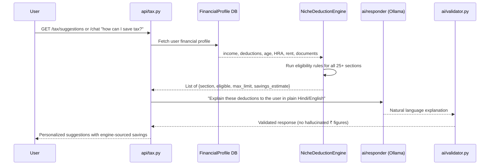

# Design Document: AI-Powered Niche Tax Deduction Suggestions

**Project:** AI Tax Copilot  
**Feature:** Smart Niche Deduction Discovery Engine  
**FY:** 2024-25 (AY 2025-26)  
**Date:** 2026-03-10  

---

## 1. Problem Statement

Most Indian taxpayers only claim the "obvious" deductions — Section 80C (PPF, ELSS), 80D (health insurance), and the standard deduction. The Income Tax Act contains **60+ deduction and exemption sections**, many of which are unknown to salaried professionals, freelancers, and small business owners. This results in tens of thousands of rupees in overpaid taxes every year.

**Tax Copilot's current `suggest_deductions.py` only covers 7 sections** (80C, 80D, 80CCD(1B), 80TTA, 24(b), 80E, 80G). The AI chatbot doesn't proactively suggest niche deductions based on the user's specific financial profile.

### Goal

Build an intelligent, context-aware suggestion engine that:
1. Proactively identifies **lesser-known deductions** the user may be eligible for
2. Provides **actionable advice** on how to claim each deduction
3. Estimates the **exact rupee savings** using the deterministic tax engine (never the LLM)
4. Surfaces suggestions contextually during chat conversations and after document uploads

---

## 2. Catalogue of Niche / Lesser-Known Tax Sections

### Tier 1 — High Impact, Widely Applicable (Most Users Don't Claim)

| Section | Description | Max Limit | Regime | Who Misses It |
|---------|-------------|-----------|--------|--------------|
| **80CCD(2)** | Employer NPS contribution | 14% salary (govt) / 10% (pvt) | Both ✅ | Salaried employees who don't ask HR to opt in |
| **80GG** | Rent paid without HRA | ₹60,000/yr | Old only | Self-employed, freelancers, those without HRA component |
| **Sec 10(13A) optimization** | HRA with rent receipts from parents | Min of 3 legs | Old only | People living with parents who pay nominal rent |
| **80D — Preventive health checkup** | Annual health checkup | ₹5,000 (within 80D limit) | Old only | Nearly everyone — most don't claim this separately |
| **80D — Senior citizen parents** | Medical expenses for uninsured parents 60+ | ₹50,000 | Old only | Those supporting elderly uninsured parents |
| **LTA carry-forward** | Unused Leave Travel Allowance | Actual fare | Old only | Employees who didn't travel in the 4-year block |
| **Food coupons / meal cards** | Employer meal vouchers (Sodexo/Pluxee) | ₹26,400/yr (₹50/meal) | Old only | Salaried employees not using meal card benefit |
| **Sec 57(iia)** | Family pension deduction | ₹25,000 | Both ✅ | Pension recipients |

### Tier 2 — Situational but Significant Savings

| Section | Description | Max Limit | Regime | Trigger Condition |
|---------|-------------|-----------|--------|-------------------|
| **80EEB** | EV loan interest | ₹1,50,000 | Old only | Purchased electric vehicle on loan (sanctioned before 31 Mar 2023) |
| **80EEA** | Affordable housing extra interest | ₹1,50,000 | Old only | First-time homebuyer, stamp value ≤ ₹45L (loan sanctioned before 31 Mar 2022) |
| **80DDB** | Medical treatment for specified diseases | ₹40,000 (₹1,00,000 for senior) | Old only | Cancer, neurological disease, AIDS, renal failure, etc. |
| **80DD** | Dependent with disability | ₹75,000 / ₹1,25,000 (severe) | Old only | Dependent family member certified disabled 40%+ |
| **80U** | Self-disability deduction | ₹75,000 / ₹1,25,000 (severe) | Old only | Taxpayer is certified person with disability |
| **80GGA** | Donations to scientific research | 100% of donation | Old only | Any non-business taxpayer who donates to approved research bodies |
| **Sec 10(10AA)** | Leave encashment at retirement | ₹25,00,000 | Both ✅ | Retiring/resigning employees |
| **Sec 10(10)** | Gratuity exemption | ₹20,00,000 | Both ✅ | Employees with 5+ years service |
| **80TTB** | Senior citizen deposit interest | ₹50,000 | Old only | Senior citizens (60+) with FD/RD/savings interest |
| **24(b) — home repair loan** | Interest on home improvement loan | ₹30,000 | Old only | Took loan specifically for home repairs |
| **54EC** | LTCG reinvested in specified bonds | ₹50,00,000 | Both ✅ | Sold land/building, invested gains in REC/PFC bonds within 6 months |

### Tier 3 — Rare but Valuable (Niche Professions)

| Section | Description | Max Limit | Regime | Who Benefits |
|---------|-------------|-----------|--------|-------------|
| **80RRB** | Patent royalty income | ₹3,00,000 | Old only | Original patent holders (registered under Patents Act, 1970) |
| **80QQB** | Royalty from literary/artistic/scientific books | ₹3,00,000 | Old only | Published authors (not textbooks/journals) |
| **80CCH(2)** | Agniveer Corpus Fund contribution | Actual contribution | Both ✅ | Agniveer defence recruits |
| **Sec 10(14)** | Special allowances (uniform, helper, research) | Actual expenditure | Varies | Employees receiving these allowances |
| **Children Education Allowance** | Under Sec 10(14)(ii) | ₹100/month × 2 children | Old only | Salaried parents (often not claimed) |
| **Hostel Expenditure Allowance** | Under Sec 10(14)(ii) | ₹300/month × 2 children | Old only | Salaried parents with children in hostel |

---

## 3. Architecture: How It Fits Into Tax Copilot

### 3.1 Core Principle (Golden Rule Preserved)

```
┌─────────────────────────────────────────────────────┐
│  DETERMINISTIC LAYER  (tax_engine/ + scripts/)      │
│  ─ Rule matching (eligibility check)                │
│  ─ Savings calculation (₹ amounts)                  │
│  ─ All numbers come from HERE                       │
└──────────────────────┬──────────────────────────────┘
                       │ engine_output
                       ▼
┌─────────────────────────────────────────────────────┐
│  AI LAYER  (ai/ + app/rag/)                         │
│  ─ Profile analysis → detect triggers               │
│  ─ Natural language explanation of WHY section       │
│    applies to the user                              │
│  ─ Actionable steps to claim deduction              │
│  ─ NEVER generates ₹ figures                        │
└──────────────────────┬──────────────────────────────┘
                       │ validated by ai/validator.py
                       ▼
┌─────────────────────────────────────────────────────┐
│  API LAYER  (api/)                                  │
│  ─ /tax/suggestions endpoint                        │
│  ─ Integrated into /chat response                   │
│  ─ Triggered after document upload confirmation     │
└─────────────────────────────────────────────────────┘
```

### 3.2 Data Flow



### 3.3 New / Modified Components

| Component | Action | Purpose |
|-----------|--------|---------|
| `scripts/niche_deductions.py` | **NEW** | Master deduction rule engine — 25+ sections with eligibility predicates |
| `schemas/suggestions.py` | **NEW** | Pydantic models for suggestion request/response |
| `scripts/suggest_deductions.py` | **MODIFY** | Import and delegate to `niche_deductions.py` for backward compatibility |
| `api/tax.py` | **MODIFY** | Add `GET /tax/suggestions` endpoint |
| `app/rag/query_kb.py` | **MODIFY** | Inject niche suggestions when intent is `deduction_advice` |
| `db/models.py` | **MODIFY** | Add fields to `FinancialProfile` for richer profiling (age, is_metro, has_ev_loan, etc.) |
| `kb/` | **MODIFY** | Add knowledge base articles on each niche section for RAG grounding |

---

## 4. Niche Deduction Engine Design — `scripts/niche_deductions.py`

### 4.1 Profile-Based Eligibility Rules

Each deduction is modeled as a rule with:

```python
@dataclass
class DeductionRule:
    section: str               # "80DDB", "80EEB", etc.
    title: str                 # Human-readable name
    description: str           # What it covers
    max_limit: float           # Maximum deduction amount
    regime: str                # "old", "new", "both"
    tier: int                  # 1 (common), 2 (situational), 3 (rare)
    eligibility_fn: Callable   # Takes UserProfile → bool
    savings_fn: Callable       # Takes UserProfile → estimated ₹ saved
    action_steps: list[str]    # What the user should do to claim this
    documents_needed: list[str]  # Proof required
    awareness_score: float     # 0-1, how unlikely the avg taxpayer knows this
```

### 4.2 Intelligent Trigger System

The engine doesn't just list all sections — it **detects signals** from the user's data:

| Signal in Profile | Triggers Suggestions For |
|-------------------|--------------------------|
| `age >= 60` | 80TTB (₹50K FD interest), 80DDB higher limit, 80D higher limit |
| `has_hra = False` AND `rent_paid > 0` | 80GG (rent without HRA) |
| `employer_nps > 0` | 80CCD(2) — verify it's being claimed |
| `has_home_loan = True` | 80EEA (if affordable housing), 24(b) repair loan |
| `has_ev_loan = True` | 80EEB (EV interest deduction) |
| `has_dependents_disabled = True` | 80DD |
| `is_disabled = True` | 80U |
| `income_from_patents > 0` | 80RRB |
| `income_from_books > 0` | 80QQB |
| `capital_gains > 0` | 54EC bonds suggestion |
| `family_pension > 0` | Sec 57(iia) |
| `documents contain "gratuity"` | Sec 10(10) exemption check |
| `documents contain "leave encashment"` | Sec 10(10AA) |
| Any salaried user | Preventive health checkup, LTA carry-forward, food coupons |

### 4.3 Savings Calculation

All savings are computed deterministically using the user's **marginal tax rate** from `tax_engine/individual_tax.py`:

```python
def estimate_saving(deduction_amount: float, marginal_rate: float) -> float:
    """
    Estimate tax saved = deduction × marginal rate × (1 + cess_rate).
    Cess is 4% on tax, so effective multiplier is marginal_rate × 1.04.
    """
    return round(deduction_amount * marginal_rate * 1.04, 2)
```

---

## 5. AI Layer: Contextual Explanation Generation

### 5.1 Prompt Strategy

When the engine identifies eligible niche deductions, the AI layer generates **personalized explanations**. The LLM prompt is grounded with:

1. **RAG context** from the knowledge base (articles on each section)
2. **Engine output** (eligible sections, limits, calculated savings)
3. **User's profile summary** (PII-masked)

Example system prompt:
```
You are TaxGPT. The tax engine has identified that the user is eligible for 
the following deductions they haven't claimed: {engine_suggestions}.

For each suggestion:
1. Explain in simple language WHY this applies to them
2. Give step-by-step instructions to claim it
3. Mention what documents they need
4. DO NOT mention any ₹ figure — those are provided separately by the engine

Use a friendly, encouraging tone. Highlight that these are "hidden savings" 
most people miss.
```

### 5.2 Chat Integration Triggers

The niche suggestion engine is invoked when:

| Trigger | Action |
|---------|--------|
| User asks *"how can I save more tax?"* | Full niche scan → top 5 suggestions |
| User asks about a specific section | Deep-dive with eligibility check |
| After document upload (e.g., Form 16 confirmed) | Auto-suggest based on extracted data |
| Regime comparison shows old regime is close/better | Surface old-regime-only deductions |
| User mentions keywords (EV, patent, disability, rent) | Targeted suggestion |

---

## 6. API Design

### `GET /tax/suggestions`

```json
// Request (query params)
{
  "user_id": "uuid",
  "regime": "old",         // or "both" for comparison
  "include_rare": false    // include Tier 3 (patent, author, etc.)
}

// Response
{
  "total_potential_savings": 52000,  // from engine
  "suggestions": [
    {
      "section": "80D",
      "subsection": "Preventive Health Checkup",
      "tier": 1,
      "eligible": true,
      "max_deduction": 5000,
      "estimated_saving": 1560,
      "regime": "old",
      "awareness_score": 0.15,
      "action_steps": [
        "Get a health checkup at any approved diagnostic center",
        "Collect the receipt/bill",
        "Claim under Section 80D while filing ITR"
      ],
      "documents_needed": ["Health checkup receipt/bill"],
      "ai_explanation": "Most people know about 80D for insurance, but did you know..."
    }
  ],
  "regime_note": "These deductions are available under the Old Regime. Switch to Old Regime to claim ₹52,000 in additional savings.",
  "engine_version": "1.0.0-FY2024-25"
}
```

### Integration with `/chat`

When the chatbot detects a deduction-related intent, it appends the suggestion data to the response:

```json
{
  "answer": "Great question! Based on your profile, I found 4 tax-saving opportunities...",
  "suggestions": [...],        // from niche engine
  "total_savings": 52000,      // from engine
  "sources": [...]             // RAG sources
}
```

---

## 7. Knowledge Base Additions

Each niche section needs a KB article for RAG grounding. Articles should be added to the `kb/` directory and indexed into ChromaDB.

### Article Template

```markdown
# Section 80EEB — Electric Vehicle Loan Interest Deduction

## What It Is
Deduction on interest paid on loan taken for purchasing an electric vehicle.

## Eligibility
- Individual taxpayers only
- Loan sanctioned between 01-Apr-2019 and 31-Mar-2023
- Applies to both 2-wheelers and 4-wheelers

## Maximum Deduction
₹1,50,000 per financial year

## How to Claim
1. Obtain interest certificate from your bank/NBFC
2. Ensure the vehicle is registered as electric (RC shows "EV")
3. Claim deduction under Section 80EEB while filing ITR-1 or ITR-2

## Documents Required
- Loan sanction letter
- Interest certificate from lender
- Vehicle RC showing electric registration

## Common Mistake
People often forget this is OVER AND ABOVE Section 24(b) if they also have a home loan.

## Tax Regime
Old Regime only
```

**Articles needed for:** 80GG, 80EEB, 80EEA, 80DDB, 80DD, 80U, 80GGA, 80RRB, 80QQB, 80TTB, 80CCH(2), 54EC, Sec 10(10), Sec 10(10AA), Sec 10(5) LTA, Sec 10(14) special allowances, Sec 57(iia), food coupons/meal vouchers, preventive health checkup.

---

## 8. User-Facing Feature: "Hidden Savings Report"

After profile setup, the user can generate a **personalized Hidden Savings Report** — a one-page summary of all unclaimed deductions.

### Report Sections

1. **💰 Your Hidden Savings** — Total estimated savings across all eligible niche deductions
2. **🔍 Deductions You're Missing** — Ranked by impact (₹ saved), with one-line explanations
3. **📋 Action Items** — Consolidated checklist of what to do before March 31
4. **⚖️ Regime Impact** — How these deductions affect Old vs New regime decision
5. **📎 Documents Checklist** — All documents needed to claim these deductions

This report can be generated as:
- A chat response (conversational format)
- A downloadable PDF (future enhancement)
- A share-friendly summary card

---

## 9. Competitive Differentiation

| Feature | ClearTax | Tax2Win | **Tax Copilot** |
|---------|----------|---------|-----------------|
| Basic 80C/80D suggestions | ✅ | ✅ | ✅ |
| Niche section awareness (80EEB, 80RRB) | ❌ | ❌ | ✅ |
| Profile-triggered suggestions | ❌ | Partial | ✅ |
| Conversational AI explanation | ❌ | ❌ | ✅ |
| Deterministic savings calculation | ❌ (manual) | ❌ | ✅ (engine-backed) |
| RAG-grounded legal accuracy | ❌ | ❌ | ✅ |
| "Awareness score" prioritization | ❌ | ❌ | ✅ |

---

## 10. Implementation Phases

### Phase 1 — MVP (Hackathon Demo)
- [ ] Expand `suggest_deductions.py` with 15 most impactful niche sections
- [ ] Add profile trigger fields to `FinancialProfile`
- [ ] Create `GET /tax/suggestions` endpoint
- [ ] Wire into chatbot intent detection
- [ ] Add 5 KB articles for top niche sections

### Phase 2 — Post-Hackathon
- [ ] Full 25+ section coverage with all eligibility rules
- [ ] "Hidden Savings Report" conversational flow
- [ ] Age/disability detection from uploaded documents
- [ ] EV loan / home loan detection from bank statements
- [ ] Tax calendar reminders ("Invest ₹X in NPS by March 31 to save ₹Y")

### Phase 3 — Production
- [ ] PDF report generation
- [ ] Year-over-year comparison ("You saved ₹30K more than last year")
- [ ] Push notifications for deadline-sensitive deductions
- [ ] Multi-language support (Hindi, Tamil, Marathi)

---

## 11. Risk Mitigation

| Risk | Mitigation |
|------|-----------|
| LLM hallucinates tax figures | Golden Rule enforced — `ai/validator.py` strips unauthorized ₹ amounts |
| Outdated section limits | All limits in `niche_deductions.py` are versioned with `MODULE_VERSION` |
| User claims ineligible deduction | Eligibility functions are conservative — require positive signals |
| PII leakage during profile analysis | `security/pii_masker.py` runs before any LLM call |
| Regime confusion | Every suggestion clearly labels "Old only" / "New only" / "Both" |

---

## 12. Success Metrics

- **Deduction discovery rate:** % of users who discover ≥1 new deduction they weren't claiming
- **Estimated savings surfaced:** Average ₹ savings identified per user
- **Suggestion acceptance rate:** % of suggestions users act on
- **Chat engagement:** Increase in chat interactions when suggestions are shown
- **Target:** Surface ≥ ₹15,000 in unclaimed deductions for 70% of old-regime users
