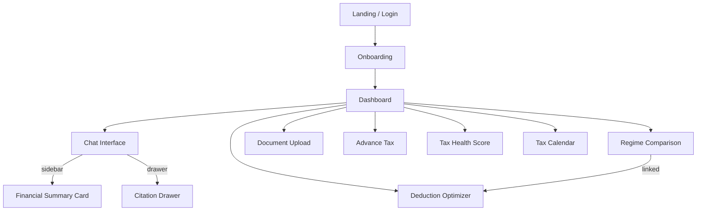

# Frontend Design Document — AI Tax Copilot

**Source:** TaxCopilot_PRD.docx + TaxCopilot_Backend_Spec.docx  
**Stack:** React.js + Tailwind CSS (per PRD Table 15)  
**Date:** 2026-03-10  

---

## 1. Overview

AI Tax Copilot is a **conversational-first** tax planning platform. The frontend is not a traditional form-based calculator — it is a chat interface with rich, contextual side panels that update in real time as the user's financial picture evolves.

### Design North Star

> A user who has never thought about tax optimization should leave their first session with a specific, actionable savings figure — not a generic recommendation. — *PRD §12*

### Key Constraints

| Constraint | Source |
|-----------|--------|
| Mobile-first responsive | PRD §9 |
| WCAG 2.1 AA | PRD §9 |
| Chrome, Safari, Firefox (latest 2) | PRD §9 |
| All rupee figures sourced from backend engine (never hardcoded or computed in frontend) | Golden Rule |
| Indian numbering format (₹10,00,000) | Backend Spec §5.2 |
| Access token in memory only — **never** localStorage | Backend Spec Table 33 |

---

## 2. Target Users & Personas

| Persona | Age | Income | Primary Feature | Opening Question |
|---------|-----|--------|----------------|-----------------|
| 🧑‍💼 Salaried (Confused Optimizer) | 26–40 | ₹8L–₹25L | Regime comparator, Form 16 upload | *"I see you're salaried. What's your annual gross salary?"* |
| 💻 Freelancer (Underserved) | 24–38 | ₹6L–₹40L | 44ADA, advance tax, expense tracker | *"As a freelancer, let's start with your total receipts this year."* |
| 🏢 Business Owner (Overwhelmed) | 30–50 | ₹15L–₹1Cr | Business module, loss tracking | *"Let's start with your business revenue for this financial year."* |
| 🎓 First-Time Filer (Learner) | 21–27 | ₹3L–₹8L | Filing checker, guided mode | *"Congrats on your first job! Let's check if you even need to file."* |

> **UX Principle:** Never start with a blank chat. Every session opens with a persona-specific question. — *PRD §8.1*

---

## 3. UX Principles (from PRD §8.1)

| # | Principle | Frontend Implementation |
|---|----------|----------------------|
| 1 | **Never start with a blank chat** | Pre-populated persona-specific opening message from `GET /onboarding/questions` |
| 2 | **Show work, not just answers** | Every tax figure has an expandable calculation trace (from `calculation_trace` JSON) |
| 3 | **One clarification at a time** | AI asks one question per message — no multi-question prompts |
| 4 | **Make impact of every decision visible** | Financial Summary Card updates in real time; profile diffs show ₹ impact |
| 5 | **Jargon is always optional** | Every tax term has an inline tooltip (e.g., *"80C →  Section 80C lets you reduce taxable income by up to ₹1.5L..."*) |
| 6 | **Surface insights, don't wait** | Proactive suggestion banners appear in chat when deductions are missed |

---

## 4. Information Architecture & Page Map



---

## 5. Page Specifications

### 5.1 Onboarding Flow

**API:** `POST /auth/register`, `GET /onboarding/questions`, `POST /onboarding/complete`

| Step | Screen | UX Detail |
|------|--------|-----------|
| 1 | Persona Selection | 4 illustrated cards: Salaried / Freelancer / Business Owner / First-Time Filer. Tap to select. |
| 2 | Quick Profile | 2–3 questions based on persona (e.g., salaried: *salary range*, *do you pay rent?*, *any investments?*) |
| 3 | Ready | Animated transition into chat with pre-populated opening question |

**Design Notes:**
- No form fields — persona-specific questions are answered via chat bubbles or quick-reply chips
- Progress indicator (Step 1/3, 2/3, 3/3) — not a progress bar (feels less like a form)
- Skip option: "I'll figure it out myself" → drops into blank chat with generic opener

---

### 5.2 Dashboard

**API:** `GET /tax/health-score`, `GET /calendar/upcoming`, `GET /tax/comparison`, `GET /profile`

The dashboard is the **home screen** after onboarding. It surfaces the most actionable information at a glance.

| Component | Position | Data Source | Behavior |
|-----------|----------|-------------|----------|
| **Tax Health Score** | Top hero | `/tax/health-score` | 0–100 gauge with color (red/amber/green). Tap → detail breakdown. |
| **Regime Recommendation** | Below score | `/tax/comparison` | Card: *"New regime saves you ₹23,400"*. Tap → full comparison page. |
| **Upcoming Deadlines** | Middle | `/calendar/upcoming` | Next 3 deadlines with countdown chips. Color-coded urgency (green/amber/red). |
| **Quick Actions** | Bottom grid | — | 4 buttons: Upload Document, Ask a Question, View Deductions, Download PDF |
| **Deduction Gap Alert** | Floating banner | `/deductions/optimizer` | *"You have ₹80,000 unused 80C capacity → save ₹24,960"* |

---

### 5.3 Chat Interface (Primary Screen)

**API:** `POST /chat/conversations/{id}/messages` (the core pipeline endpoint)

This is the **flagship screen**. The layout is a two-panel design:

```
┌──────────────────────────────────────────────────────┐
│  Header: TaxGPT logo + FY selector + user avatar     │
├──────────────────────┬───────────────────────────────┤
│                      │  FINANCIAL SUMMARY CARD       │
│   CHAT PANEL         │  ─ Total Income: ₹15,00,000  │
│                      │  ─ Deductions: ₹2,50,000     │
│  [AI] Your tax...    │  ─ Taxable Income: ₹12,50K   │
│  [User] What if...   │  ─ Tax (New): ₹1,12,500      │
│                      │  ─ Tax (Old): ₹1,37,500      │
│   ┌──────────────┐   │  ─ Regime: ✅ New saves ₹25K  │
│   │ Message input │   │                              │
│   └──────────────┘   │  [Edit any field]             │
│  📎 Upload  🎤 Voice │  [View full breakdown →]      │
├──────────────────────┴───────────────────────────────┤
│  Quick replies: "Show regime comparison" | "Upload   │
│  Form 16" | "What deductions am I missing?"          │
└──────────────────────────────────────────────────────┘
```

#### Chat Panel Behavior

| Feature | Detail |
|---------|--------|
| **Message types** | Text bubble, tax calculation card (expandable), document preview card, suggestion card, error card |
| **Tax Calculation Card** | Inline card triggered when engine runs. Shows: gross → deductions → taxable → slab calc → cess → total. Expandable. |
| **Suggestion Card** | Yellow-highlighted card: *"💡 Did you know? Section 80CCD(1B) lets you save ₹15,600 more with NPS."* |
| **Citation button** | Every AI message has a *"📚 Sources"* link → opens Citation Drawer. |
| **Profile diff toast** | When a profile field changes mid-conversation: toast showing *"Income updated: ₹12L → ₹15L. Tax increased by ₹45,000."* from `profile_diff` in response. |
| **Quick replies** | Context-aware chips below the input: adapt based on conversation state. |
| **Amount parsing** | Input box accepts natural language: "10 lakhs", "₹10L", "15,00,000" — parsed by backend. |
| **Typing indicator** | Animated dots while waiting for AI response (P95 < 4s per PRD §9). |
| **Feedback** | 👍/👎 on every AI message → `POST /feedback/message`. Correction flow on 👎. |

#### Financial Summary Card (Sidebar)

| Feature | Detail |
|---------|--------|
| **Real-time updates** | Every confirmed data point updates the card immediately. Uses response `tax_updated: true` flag. |
| **Editable fields** | Tap any confirmed item → inline edit → triggers `PATCH /profile` → full recalculation. |
| **Diff animation** | When a value changes, old value fades out (red strikethrough), new value fades in (green highlight). |
| **Regime toggle** | Small toggle at the bottom: *"Show Old Regime / Show New Regime"* — switches displayed tax figure. |
| **Collapse on mobile** | On screens < 768px, summary card becomes a collapsible bottom sheet. |

#### Citation Drawer

Slides in from the right when *"Sources"* is tapped.

| Field | Source |
|-------|--------|
| Section number | `citations[].section` from message response |
| Excerpt | `citations[].text` |
| Financial Year | `citations[].fy` |
| Link | Deep link to Income Tax Act section (external) |

---

### 5.4 Regime Comparison Page

**API:** `GET /tax/comparison`

The highest-value single screen for most users.

```
┌─────────────────────────────────────────────────┐
│  🏆 Recommended: NEW REGIME saves ₹23,400       │
│  Reason: "Your deductions (₹1.5L) don't offset  │
│  the higher new-regime standard deduction..."     │
├────────────────────┬────────────────────────────┤
│   OLD REGIME       │    NEW REGIME              │
│   ────────────     │    ────────────            │
│   Gross: ₹15,00K  │    Gross: ₹15,00K         │
│   Std Ded: ₹50K   │    Std Ded: ₹75K          │
│   80C: ₹1,50,000  │    80C: ₹0 (not allowed)  │
│   80D: ₹25,000    │    80D: ₹0                │
│   Taxable: ₹12,25K│    Taxable: ₹14,25K       │
│   Base Tax: ₹X     │    Base Tax: ₹Y           │
│   Surcharge: ₹0   │    Surcharge: ₹0          │
│   Rebate 87A: ₹0  │    Rebate 87A: ₹0         │
│   Cess: ₹X        │    Cess: ₹Y               │
│   ────────────     │    ────────────            │
│   TOTAL: ₹1,37,500│    TOTAL: ₹1,12,500  ✅    │
│   Eff Rate: 9.2%  │    Eff Rate: 7.5%         │
├────────────────────┴────────────────────────────┤
│  💡 Breakeven: Invest ₹3,20,000 more in 80C/    │
│  NPS to make Old Regime better.                  │
├─────────────────────────────────────────────────┤
│  📊 Deduction Opportunities (3 found)            │
│  ┌ 80C: ₹0 used / ₹1.5L limit — save ₹46,800 ┐│
│  ├ NPS: ₹0 used / ₹50K limit — save ₹15,600  ┤│
│  └ 80D: ₹0 used / ₹25K limit — save ₹7,800   ┘│
└─────────────────────────────────────────────────┘
```

| Feature | Detail |
|---------|--------|
| Winner badge | Green checkmark + highlight on the cheaper regime |
| Savings callout | Large, bold: *"₹23,400 saved"* — tappable for explanation |
| Breakeven | Only shown when new regime wins — *"Invest ₹X more in deductions to flip to Old Regime"* |
| Deduction opportunities | Progress bars showing used/available capacity per section |
| Calculation trace | Expandable accordion on each line item (data from `calculation_trace`) |
| Share | *"Share your comparison"* → generates image card for WhatsApp/social |

---

### 5.5 Document Upload Page

**API:** `POST /documents/upload`, `GET /documents/{id}/status`, `GET /documents/{id}/extraction`, `POST /documents/{id}/confirm`, `POST /documents/{id}/correct`

```
┌──────────────────────────────────────────────────┐
│  📄 Upload Tax Documents                          │
│                                                   │
│  ┌─────────────────────────────────────────────┐ │
│  │           Drag & Drop Zone                   │ │
│  │    or click to browse (PDF, JPG, PNG ≤10MB)  │ │
│  │    📎 Form 16 · AIS · Salary Slip · Rent     │ │
│  └─────────────────────────────────────────────┘ │
│                                                   │
│  Recent Uploads:                                  │
│  ┌ form16_2024.pdf    ✅ Extracted    [View] ┐   │
│  ├ ais_statement.pdf  🔄 Processing...       ┤   │
│  └ salary_jan.pdf     ❌ Failed     [Retry]  ┘   │
└──────────────────────────────────────────────────┘
```

#### Extraction Preview (after OCR completes)

| Field | Extracted Value | Confidence | Action |
|-------|----------------|------------|--------|
| Employer Name | Infosys Ltd | 🟢 0.97 | ✏️ Edit |
| Gross Salary | ₹15,00,000 | 🟢 0.95 | ✏️ Edit |
| TDS Deducted | ₹1,80,000 | 🟡 0.72 | ✏️ Edit ⚠️ |
| 80C Investments | ₹1,20,000 | 🔴 0.45 | ✏️ Edit ❗ |

- **Color coding:** Green (≥ 0.85), Amber (0.60–0.84), Red (< 0.60)
- Red/amber fields are expanded by default with a warning
- **Confirm All** button at the bottom triggers `POST /documents/{id}/confirm` → updates profile → recalculates tax
- **Mismatch Alert:** If Form 16 and AIS are both uploaded and TDS differs → banner: *"⚠️ TDS mismatch: Form 16 shows ₹1,80,000, AIS shows ₹1,75,000. [See details]"* (from `GET /documents/mismatch`)

---

### 5.6 Deduction Optimizer Page

**API:** `GET /deductions/optimizer`, `GET /deductions/80c/options`, `GET /deductions/nps/recommendation`

| Component | Detail |
|-----------|--------|
| **Deduction Gap Cards** | One card per section (80C, 80D, NPS, etc.) with progress bar: used/limit. Estimated saving shown. |
| **80C Breakdown** | Sub-cards: ELSS, PPF, EPF, LIC, NSC, Tax-saving FD. Shows current allocation + remaining capacity. |
| **NPS Recommendation** | *"Invest ₹4,167/month in NPS to fully utilise your ₹50,000 80CCD(1B) deduction — save ₹15,600."* |
| **HRA Optimizer** | If rent is close to threshold: *"Increasing rent by ₹2,000/month would increase your HRA exemption by ₹X."* |
| **44ADA Check** | For freelancers: *"You're eligible for presumptive taxation. This would reduce your taxable income by ₹X."* |
| **Niche Deductions** | From the niche deduction engine — Tier 1/2 suggestions with awareness scores |

---

### 5.7 Advance Tax Page

**API:** `GET /tax/advance-tax`, `POST /tax/advance-tax/mark-paid`

Visual timeline with 4 quarterly milestones:

```
  Jun 15        Sep 15        Dec 15        Mar 15
    ●─────────────●─────────────●─────────────●
   15%           45%           75%          100%
  ₹9,000       ₹27,000      ₹45,000      ₹60,000
   ✅ Paid      ⏳ Due in     ◻️ Upcoming   ◻️ Upcoming
                 12 days
```

| Feature | Detail |
|---------|--------|
| Mark as paid | Tap ⏳ → input amount + date → `POST /tax/advance-tax/mark-paid` |
| Interest calculator | If missed: shows Section 234C penalty amount |
| Threshold check | If total tax < ₹10,000: *"You don't need to pay advance tax."* |
| Recalculation | If income changes mid-year, timeline updates with revised amounts |

---

### 5.8 Tax Health Score

**API:** `GET /tax/health-score`

Large circular gauge (0–100) with color gradient (red → amber → green).

| Factor | Weight | Example Improvement |
|--------|--------|-------------------|
| Deductions utilised | 30% | *"Invest ₹50K in NPS → score +8"* |
| Advance tax compliance | 25% | *"Pay Q2 installment → score +12"* |
| Document completeness | 20% | *"Upload AIS → score +6"* |
| Regime optimality | 15% | *"Already optimal ✅"* |
| Profile completeness | 10% | *"Add HRA details → score +3"* |

Each factor is a tappable row with a one-click improvement action.

---

## 6. Reusable Component Library

| Component | Props | Used In |
|-----------|-------|---------|
| `<TaxCalculationCard>` | `breakdown: RegimeBreakdown` | Chat, Regime Comparison |
| `<DeductionGapBar>` | `section, used, limit, saving` | Optimizer, Chat suggestions |
| `<ConfidenceIndicator>` | `value: 0-1, label` | Document extraction preview |
| `<ProfileDiffToast>` | `field, oldVal, newVal, taxImpact` | Chat, Profile edit |
| `<JargonTooltip>` | `term, explanation` | Everywhere |
| `<QuickReplyChip>` | `label, action` | Chat input area |
| `<TimelineNode>` | `date, label, status, amount` | Advance tax, Calendar |

---

## 7. API Integration Map

### Auth & Session

| Frontend Action | API Call | Token Handling |
|----------------|----------|---------------|
| Register | `POST /auth/register` | Store access token in memory, refresh in HttpOnly cookie |
| Login | `POST /auth/login` | Same |
| Auto-refresh | `POST /auth/refresh` | Interceptor on 401 — silent refresh before retry |
| Logout | `POST /auth/logout` | Clear memory token, cookie cleared server-side |

### Core Pipeline (Chat)

| Frontend Action | API Call | Response Handling |
|----------------|----------|------------------|
| Send message | `POST /chat/conversations/{id}/messages` | Parse `content`, `citations`, `tax_updated`, `profile_diff` |
| If `tax_updated: true` | — | Refresh Financial Summary Card + trigger diff animation |
| If `profile_diff` present | — | Show `<ProfileDiffToast>` with field, old → new, ₹ impact |
| Feedback | `POST /feedback/message` | Optimistic UI — thumb animates immediately |
| Correction | `POST /feedback/correction` | Opens inline correction form, re-evaluates on submit |

### Tax Screens

| Screen | Primary API | Polling/Refresh |
|--------|-------------|----------------|
| Regime Comparison | `GET /tax/comparison` | Refresh after any profile change |
| Deduction Optimizer | `GET /deductions/optimizer` | Refresh after confirm or profile edit |
| Advance Tax | `GET /tax/advance-tax` | Refresh after mark-paid or income change |
| Health Score | `GET /tax/health-score` | Refresh on dashboard mount + after any profile change |
| Tax Calendar | `GET /calendar/deadlines` | Once per session + after profile change |
| PDF Download | `GET /tax/summary/pdf` | Returns signed URL → trigger browser download |

### Document Pipeline

| Step | API Call | Frontend Behavior |
|------|----------|------------------|
| Upload | `POST /documents/upload` | Show upload progress bar, move to "Processing" state |
| Poll status | `GET /documents/{id}/status` | Poll every 2s until `status: complete` or `failed` |
| Show extraction | `GET /documents/{id}/extraction` | Render color-coded field table with edit buttons |
| User confirms | `POST /documents/{id}/confirm` | Disable confirm button, show "Profile updated" toast |
| User corrects | `POST /documents/{id}/correct` | Inline field edit → re-extract that field |
| Mismatch check | `GET /documents/mismatch` | Show warning banner if Form 16 + AIS both present |

---

## 8. Responsive Design

| Breakpoint | Layout |
|-----------|--------|
| **≥ 1280px** (Desktop) | Two-panel: Chat + sidebar Financial Summary Card |
| **768–1279px** (Tablet) | Chat full-width, Financial Summary as collapsible top panel |
| **< 768px** (Mobile) | Chat full-width, Financial Summary as bottom sheet. Quick replies become horizontally scrollable chips. Document upload is full-screen modal. |

### Mobile-Specific Adaptations

- Regime comparison stacks vertically (Old on top, New below)
- Advance tax timeline becomes a vertical list
- Citation drawer becomes full-screen overlay
- Deduction optimizer cards stack in a single column
- Touch targets: minimum 44×44px (WCAG 2.1)

---

## 9. Animations & Micro-Interactions

| Interaction | Animation | Duration |
|------------|-----------|----------|
| Tax figure update | Number counter animation (old → new) | 600ms ease-out |
| Profile diff | Red strikethrough fades out, green highlight fades in | 400ms |
| Regime winner | Pulsing green glow + confetti particle burst | 800ms |
| Health score change | Gauge needle sweeps to new position | 1000ms ease-in-out |
| Document upload | Progress ring around file icon | Real-time |
| Suggestion card entry | Slide up from bottom with subtle bounce | 300ms |
| Quick reply tap | Chip scales down 95% → releases | 150ms |
| Chat message appear | Fade in + slide up 8px | 200ms |

---

## 10. Accessibility (WCAG 2.1 AA)

| Requirement | Implementation |
|------------|---------------|
| Keyboard navigation | All interactive elements focusable. Tab order follows visual layout. |
| Screen reader | ARIA labels on all cards, gauges, progress bars. Live regions for real-time updates. |
| Color contrast | Minimum 4.5:1 for text, 3:1 for large text/UI components |
| Focus indicators | Visible focus ring (2px solid, offset 2px) on all interactive elements |
| Motion | `prefers-reduced-motion` media query disables all animations |
| Text scaling | Layout supports up to 200% text zoom without horizontal scroll |
| Error states | All errors have both color AND icon/text indicators (not color-alone) |

---

## 11. Color & Theme System

### Light Theme (Default)

| Token | Value | Usage |
|-------|-------|-------|
| `--primary` | `#2563EB` (Blue 600) | Buttons, links, active states |
| `--primary-light` | `#DBEAFE` (Blue 100) | Card backgrounds, highlights |
| `--success` | `#059669` (Emerald 600) | Winning regime, high confidence, paid status |
| `--warning` | `#D97706` (Amber 600) | Medium confidence, approaching deadline |
| `--danger` | `#DC2626` (Red 600) | Low confidence, missed deadline, errors |
| `--surface` | `#FFFFFF` | Card backgrounds |
| `--surface-secondary` | `#F9FAFB` (Gray 50) | Page background, chat panel |
| `--text-primary` | `#111827` (Gray 900) | Headings, primary content |
| `--text-secondary` | `#6B7280` (Gray 500) | Descriptions, timestamps |

### Dark Theme

| Token | Value |
|-------|-------|
| `--primary` | `#60A5FA` (Blue 400) |
| `--surface` | `#1F2937` (Gray 800) |
| `--surface-secondary` | `#111827` (Gray 900) |
| `--text-primary` | `#F9FAFB` (Gray 50) |

### Typography

| Element | Font | Size | Weight |
|---------|------|------|--------|
| Headings | Inter | 24/20/16px | 700/600 |
| Body | Inter | 14px | 400 |
| Monospace (amounts) | JetBrains Mono | 14px | 500 |
| Small/caption | Inter | 12px | 400 |

---

## 12. State Management Strategy

| State Type | Approach | Scope |
|-----------|----------|-------|
| Auth tokens | React Context + in-memory variable | App-wide |
| User profile | React Query (TanStack Query) — cached, auto-refetched | App-wide |
| Chat messages | React Query with optimistic updates | Per-conversation |
| Tax calculations | React Query — invalidated on profile change | App-wide |
| UI state (modals, drawers) | Local component state or Zustand | Component/page |
| Theme preference | localStorage + CSS custom properties | App-wide |

**Key Pattern:** All tax figures flow from the backend. The frontend never computes, estimates, or interpolates any ₹ value. React Query's `invalidateQueries` ensures fresh engine data after every profile mutation.

---

## 13. Implementation Plan (Phased)

### Phase 1 — Hackathon MVP

| Priority | Screen/Component | API Dependency | Est. Effort |
|----------|-----------------|----------------|-------------|
| P0 | Auth (login/register) | `/auth/*` | 1 day |
| P0 | Chat interface (core) | `/chat/conversations/*/messages` | 2 days |
| P0 | Financial Summary Card | `/profile`, `/tax/comparison` | 1 day |
| P0 | Regime Comparison page | `/tax/comparison` | 1 day |
| P0 | Document Upload + extraction preview | `/documents/*` | 1.5 days |
| P1 | Deduction Optimizer | `/deductions/optimizer` | 1 day |
| P1 | Quick reply chips | — (frontend only) | 0.5 day |

### Phase 2 — Post-Hackathon

- Advance Tax timeline + mark-paid flow
- Tax Health Score dashboard
- Tax Calendar with smart alerts
- PDF download
- Dark theme
- Mobile receipt camera capture
- Profile version history + diff viewer

### Phase 3 — Platform

- Scenario Planner (what-if calculator)
- Family tax planning multi-profile
- WhatsApp bot integration
- CA Handoff export
- Peer benchmarking cards
- Budget Day Live Calculator overlay
- Multi-language (Hindi, Tamil, Marathi)

---

## 14. Directory Structure (Proposed)

```
taxcopilot-frontend/
├── public/
│   └── index.html
├── src/
│   ├── api/               # API client + React Query hooks
│   │   ├── client.ts      # Axios instance with auth interceptor
│   │   ├── auth.ts        # useLogin, useRegister, useRefresh
│   │   ├── chat.ts        # useSendMessage, useConversations
│   │   ├── tax.ts         # useComparison, useAdvanceTax, useHealthScore
│   │   ├── documents.ts   # useUpload, usePollStatus, useConfirm
│   │   └── profile.ts     # useProfile, usePatchProfile
│   ├── components/        # Reusable UI components
│   │   ├── TaxCalculationCard.tsx
│   │   ├── DeductionGapBar.tsx
│   │   ├── ConfidenceIndicator.tsx
│   │   ├── ProfileDiffToast.tsx
│   │   ├── JargonTooltip.tsx
│   │   ├── QuickReplyChip.tsx
│   │   ├── TimelineNode.tsx
│   │   └── HealthGauge.tsx
│   ├── pages/
│   │   ├── Login.tsx
│   │   ├── Onboarding.tsx
│   │   ├── Dashboard.tsx
│   │   ├── Chat.tsx
│   │   ├── RegimeComparison.tsx
│   │   ├── DocumentUpload.tsx
│   │   ├── DeductionOptimizer.tsx
│   │   ├── AdvanceTax.tsx
│   │   └── TaxHealthScore.tsx
│   ├── context/
│   │   └── AuthContext.tsx
│   ├── hooks/
│   │   ├── useAuth.ts
│   │   └── useIndianCurrency.ts  # ₹ formatting hook
│   ├── styles/
│   │   ├── globals.css    # Design tokens + Tailwind base
│   │   └── theme.ts       # Dark/light theme config
│   ├── utils/
│   │   ├── formatCurrency.ts  # Indian numbering: ₹10,00,000
│   │   └── constants.ts
│   ├── App.tsx
│   └── main.tsx
├── tailwind.config.js
├── package.json
└── vite.config.ts
```
